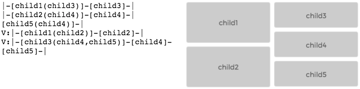

[](https://travis-ci.org/IjzerenHein/autolayout.js)

AutoLayout.js implements Apple's [Auto Layout](https://developer.apple.com/library/ios/documentation/UserExperience/Conceptual/AutolayoutPG/Introduction/Introduction.html) and [Visual Format Language](https://developer.apple.com/library/ios/documentation/UserExperience/Conceptual/AutolayoutPG/VisualFormatLanguage/VisualFormatLanguage.html) in Javascript. Auto layout is a system which lets you perform lay out using mathematical relationships (constraints). It uses the awesome [Cassowary.js](https://github.com/slightlyoff/cassowary.js) library to do the actual constraint resolving and implements Apple's constraint system and Visual Format Language (vfl) on top of that.

[](https://rawgit.com/IjzerenHein/visualformat-editor/master/dist/index.html?vfl=example)
*Visual Format Language Example **(click image to edit)***


## Index
- [Getting started](#getting-started)
  - [Installation](#installation)
  - [Using the API](#using-the-api)
  - [API Documentation](#api-documentation)  
- [Extended Visual Format Language (EVFL)](#extended-visual-format-language-evfl)
- [Additional resources](#resources)
- [ToDo list](#todo-list)

## Getting started

AutoLayout.js is an abstract library for integrating Auto Layout and VFL into other javascript technologies. It does not contain
DOM layouting or anything like that. It provides a simple API and programming model that you can use to build your own auto layout and VFL solution. An example of this is the The [Visual Format Editor](https://rawgit.com/IjzerenHein/visualformat-editor), which is built using [famo.us](http://famous.org) and [famous-flex](https://github.com/IjzerenHein/famous-flex). AutoLayout.js is written in ES6 and contains transpiled output files.

### Installation

    npm install autolayout

AutoLayout.js has a dependency on [Cassowary.js](https://github.com/slightlyoff/cassowary.js). When you are using the `dist/autolayout{.min}.js` file, make sure Cassowary.js is loaded as well.

```html
<head>
  <script type="text/javascript" src="node_modules/cassowary/bin/c.js"></script>
  <script type="text/javascript" src="node_modules/autolayout/dist/autolayout.js"></script>
</head>
```

```javascript
var AutoLayout = window.AutoLayout;
```

Or when using a bundler like webpack or browserify, use:

```javascript
var AutoLayout = require('autolayout.js'); // make sure an ES6 transpiler is installed for .es6 files
```

### Using the API

To parse VFL into constraints, use:

```javascript
try {
  // The VFL can be either a string or an array of strings.
  // strings may also contain '\n' which indicates that a new line of VFL will begin.
  var constraints = AutoLayout.VisualFormat.parse([
    '|-[child(==child2)]-[child2]-|',
    'V:|[child(==child2)]|',
  ]);
} catch (err) {
    console.log('parse error: ' + err.toString());
}
```

A View is the main entity onto which constraints are added. It uses the cassowary SimplexSolver to add
relations and variables. You can set the size of the view and other properties such as spacing. When constraints are added it automatically creates so called "sub-views" for every unique name that is encountered in the constraints. The evaluated size and position of these sub-views can be accessed through the `.subViews` property.

```javascript
var view = new AutoLayout.View({
    constraints: constraints, // initial constraints (optional)
    width: 100,               // initial width (optional)
    height: 200,              // initial height (optional)
    spacing: 10               // spacing size to use (optional, default: 8)
});

// get the size and position of the sub-views
for (var key in view.subViews) {
    console.log(key + ': ' + view.subViews[key]);
    // e.g. {
    //   name: 'child1',
    //   left: 20,
    //   top: 10,
    //   width: 70,
    //   height: 80
    // }
}
```

By changing the size, the layout is re-evaluated and the subView's are updated:

``` javascript
view.setSize(300, 600);

// get the new size & position of the sub-views
for (var key in view.subViews) {
    console.log(key + ': ' + view.subViews[key]);
}
```

Instead of using VFL, you can also add constraints directly.
The properties are similar to those of [NSLayoutConstraint](https://developer.apple.com/library/ios/documentation/AppKit/Reference/NSLayoutConstraint_Class).

```
view.addConstraint({
    view1: 'child3',
    attr1: 'width',    // see AutoLayout.Attribute
    relation: 'equ',   // see AutoLayout.Relation
    view2: 'child4',
    attr2: 'width',    // see AutoLayout.Attribute
    constant: 10,
    multiplier: 1
});
```

### API Documentation

[The API reference documentation can be found here.](docs/AutoLayout.md)


## Extended Visual Format Language (EVFL)

Apple's Visual Format Language prefers good notation over completeness of expressibility. Because of this some useful constraints cannot be expressed by "Standard" VFL. AutoLayout.js defines an extended syntax which you can optionally use.

To enable the extended syntax, set option `extended` to `true` when parsing the visual format:

```javascript
var evfl = '|-[view1(==50%)]';
var constraints = AutoLayout.VisualFormat.parse(evfl, {extended: true});
```

## Proportional widths & heights

To make the width or height proportional to the size of the **parent**, you can use the following % syntax:

    |-[view1(==50%)]    // view1 is 50% the width of the parent (regardless of any spacing)
    [view1(>=50%)]      // view1 should never be more than 50% the width of the parent

And to make the width or height proportional to **another view**, use:

    |-[view1(==view2/2)]-[view2]-|  // view1 is half the width of view2
    |-[view1(==view2*4)]-[view2]-|  // view1 is four times the width of view2


## Additional resources
- [Apple's Auto Layout](https://developer.apple.com/library/ios/documentation/UserExperience/Conceptual/AutolayoutPG/Introduction/Introduction.html)
- [Visual Format Language](https://developer.apple.com/library/ios/documentation/UserExperience/Conceptual/AutolayoutPG/VisualFormatLanguage/VisualFormatLanguage.html)
- [Cassowary.js](https://github.com/slightlyoff/cassowary.js)
- [Overconstrained](http://overconstrained.io)
- [Visual Format Editor](https://rawgit.com/IjzerenHein/visualformat-editor)
- [famous-flex](https://rawgit.com/IjzerenHein/famous-flex)


## ToDo list

AutoLayout.js is currently a work in progress. Once feature complete, this todo list will be removed
and replaced by a roadmap.

Overal:
- [X] Toolchain (ES6, external cassowary.js, distributable output, testing, doc generation, travis CI)
- [ ] Instructions
- [ ] Documentation
- [ ] Examples

Features:
- [X] Namespace & classes (AutoLayout, VisualFormat, View, Relation, Attribute)
- [X] Visual format
  - [X] Vfl Parser (thanks to the awesome angular-autolayout team!)
  - [X] Size constraints
  - [X] Greater than, less than relationships.
  - [X] Percentage support (e.g. |-[child(50%)]-[child2]-])
- [X] Equality relationships
  - [X] Base functionality
  - [X] Multiplier support
- [X] In-equality relationships
- [X] Spacing.
- [ ] Priorities & weights.
- [ ] Checking for ambigous layout.
- [ ] Fitting size?
- [ ] Intrinsic content size?
- [ ] Content hugging?
- [ ] Compression resistance?
- [ ] Remove constraints?
- [ ] Generate visual sub-view output from `View` (ASCII-art'ish)
- [ ] Get constraint definitions from `View`
- [ ] LTR (left to right reading) (Attribute.LEADING & Attribute.TRAILING)
- [ ] Baseline support?
- [ ] Margins? (View & Attributes)

- Parked Features:
  - [ ] Variables support (.e.g. |-(leftMargin)-[child]]).


## Contribute

If you like this project and want to support it, show some love
and give it a star.

If you want to participate in development, drop me a line or just issue a pull request.
Also have a look at [CONTRIBUTING](./CONTRIBUTING.md).


## Contact
-   @IjzerenHein
-   hrutjes@gmail.com (for hire)

© 2015 Hein Rutjes
